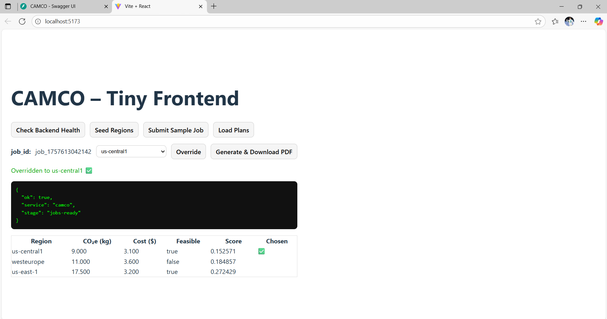
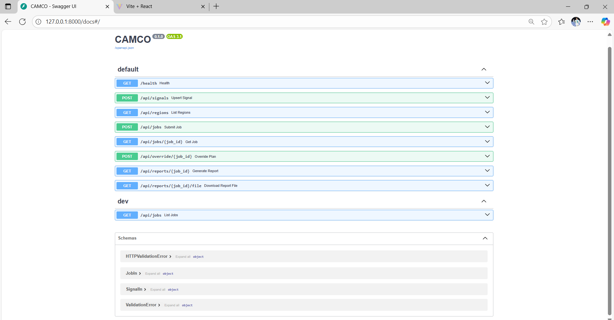

# 🌍 CAMCO — Carbon-Aware Multi-Cloud Orchestrator

[](https://fastapi.tiangolo.com/)
[](https://react.dev/)
[](https://www.python.org/)
[](LICENSE)

⚡ A full-stack demo that schedules cloud batch jobs across regions to minimize **carbon emissions (CO₂e)** while respecting **cost** and **latency** constraints.  
✅ Built with **FastAPI** (backend), **React** (frontend), and **ReportLab** (PDF reports).  
📑 Generates **audit-ready decision reports** and supports **manual overrides**.

---

## 📋 Table of Contents
- [Features](#-features)
- [Demo Screenshots](#-demo-screenshots)
- [Quickstart](#-quickstart)
- [Tech Stack](#-tech-stack)
- [Future Improvements](#-future-improvements)

---

## ✨ Features
- 🌱 **Carbon-aware planning** — treats carbon as a first-class SLA  
- 💵 **Cost + Latency constraints** — ensures feasible deployments  
- 📑 **PDF Reports** — audit-ready decision docs for governance  
- 🔄 **Manual Overrides** — operators can override chosen region with rationale  
- 🎨 **Simple React UI** — buttons, job submission, plan table, and PDF download  

---

# CAMCO — Carbon-Aware Multi-Cloud Orchestrator (MVP)

A tiny demo that schedules batch jobs across cloud regions to **minimize carbon emissions (CO₂e)** while respecting **latency** and **cost** constraints. It produces an **audit-ready PDF** report and supports **manual overrides**.

---

## Why this is relevant
- Treats **carbon as a first-class SLO** (Green SLA) next to cost & latency.
- **Explainable** output with a signed-style decision report.
- Lines up with Accenture focus areas: **Cloud, Sustainability, Trust**.

---

## Quickstart

### Backend (FastAPI + SQLite)
```bash
# from project root
python -m venv .venv
.\.venv\Scripts\Activate.ps1     # (Windows PowerShell)
pip install -r requirements.txt  # or: pip install fastapi uvicorn reportlab pydantic
uvicorn app.main:app --reload --port 8000 --app-dir backend


## Demo Screenshots

### Frontend



### Backend




